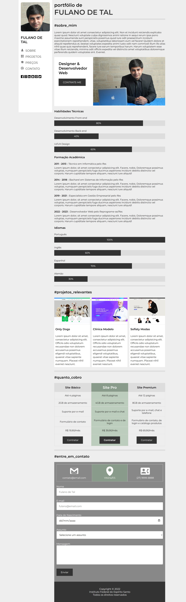

# Atividade Prática da Semana 3  

Na atividade prática da semana 2, você foi desafiado a criar um site de portfólio pessoal do zero! Na atividade da semana 3, o foco será no CSS. Você está recebendo o código-fonte de um site de portfólio pessoal semiacabado. Sua tarefa será concluí-lo. Para isso, você deverá abrir o arquivo "estilos.css" e completar os seletores CSS nos trechos comentados usando as proprieades adequadas para o que é pedido. Depois disso, altere o conteúdo da página HTML para criar o seu próprio portfólio pessoal. Analise cada uma das seções e substitua as fotos e textos por seus próprios dados. Você também pode trocar cores e fontes de letra para deixar adequado ao seu gosto. 

Para começar, selecione o arquivo "index.html" e clique no botão "Run" no cabeçalho para visualizar a renderização da página no navegador incorporado do Repl.it. Depois disso, selecione o arquivo "estilos.css" e comece a trabalhar nele. Enquanto estiver fazendo as alterações no código CSS, você pode pressionar "Ctrl+S" para aplicá-las à visualização do arquivo "index.html". Faça isso a cada alteração e observe o impacto causado. Isso te ajudará a compreender a utilidade de cada uma das propriedades CSS que estão sendo trabalhadas. Para concluir, não deixe também de assistir ao vídeo de apresentação dessa atividade, pois ele tem dicas valiosas. A figura abaixo mostra a versão concluída do site. Bons estudos!

## Site Pronto

